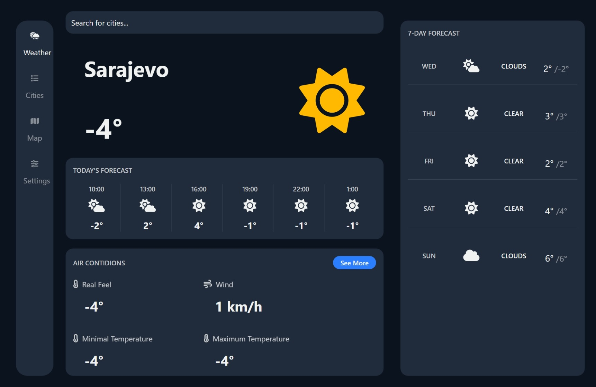
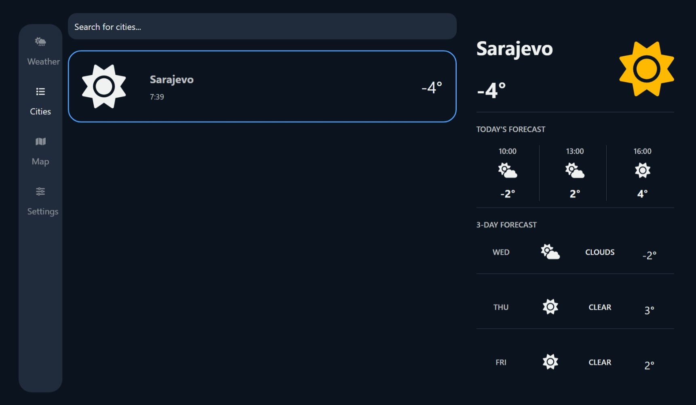
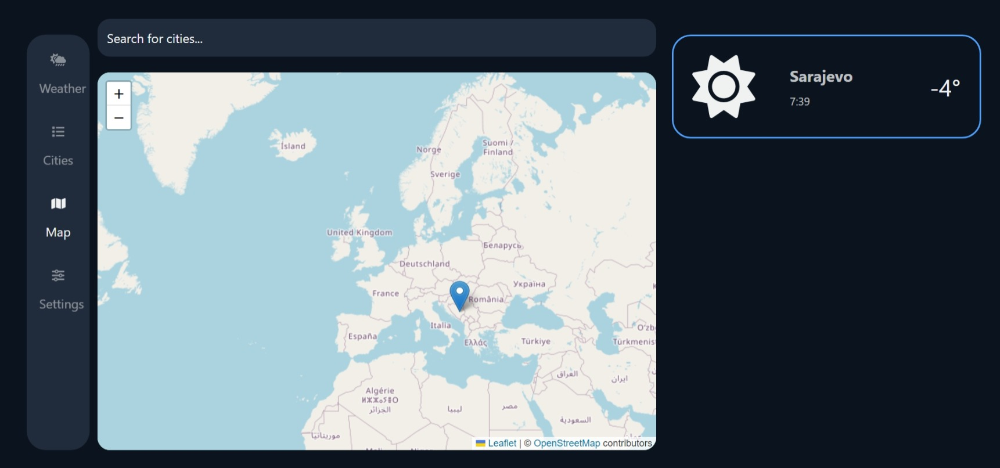
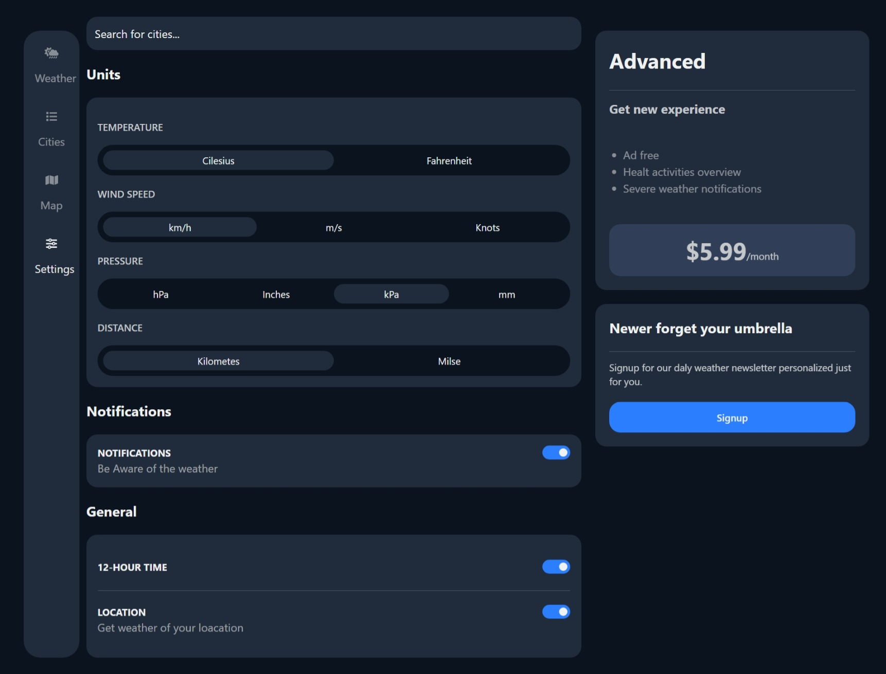

# React Weather Web App

This is react weather web app ready for use, mobile frendly, with real weather data from **OpenWeatherMap**.

## Preview

[live demo](https://kajanija.github.io/React-Weather-Web-App/)

### Home



### Cities



### Map



### Settings



## How to install

### Get from Github

Clone this repository from GitHub

```bash
git clone https://kajanija.github.io/React-Weather-Web-App/
```

### Dependencies

Install all dependencies

```bash
cd React-Weather-Web-App
npm install
```

### API

Go to "src/data/globalStates.js and change

```bash
const API_KEY = "YOUR API KEY";
```

with yours OpenWeatherMap API key.

### Run

Run on local machine

```bash
npm run dev
```

### Other

**useState**
**useEffect**
**useGlobalState** from **react-hook-global-state**
**OpenWeatherMapAPI**
**Tailwindcss**
**Vite**
